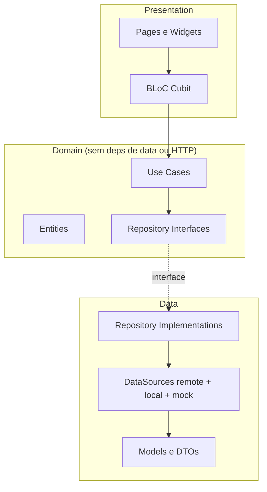
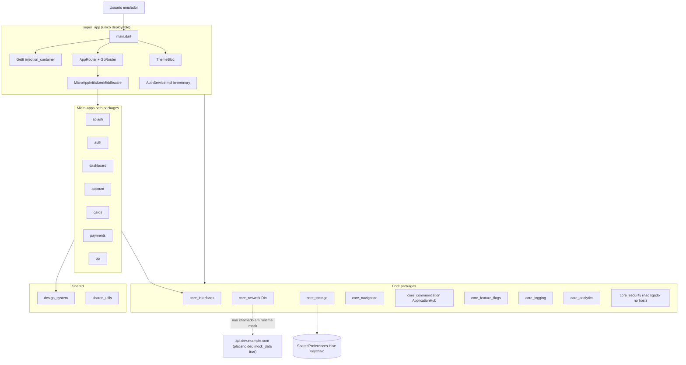
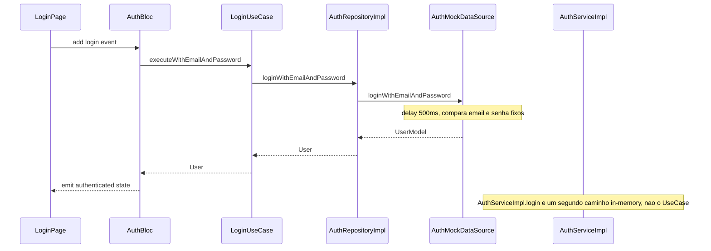
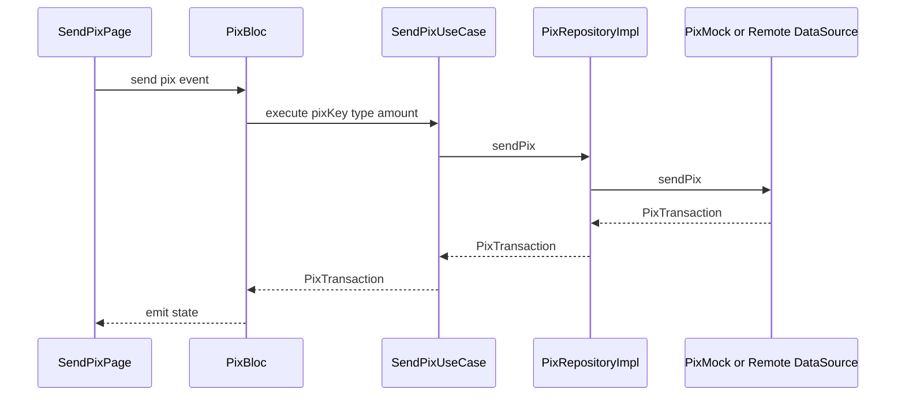

# 02 — Arquitetura AS-IS

> Fontes: `super_app/lib/main.dart`, `super_app/lib/core/di/injection_container.dart`, `super_app/lib/core/router/app_router.dart`, `super_app/lib/core/router/route_middleware.dart`, `packages/core/core_interfaces/lib/src/micro_app.dart`, `packages/core/core_interfaces/lib/src/base_micro_app.dart`, `packages/micro_apps/*/lib/src/*_micro_app.dart`.

## Padrão arquitetural detectado

Mistura de dois padrões dos 10 reconhecidos:

1. **Modular Monolith** no nível do repositório — um único deployable (`super_app`) orquestra 7 micro-apps como pacotes Dart path-local. Não há processos, bancos ou deploys separados. Sinal: `melos.yaml:L10-L15` lista `packages/core/**`, `packages/shared/**`, `packages/micro_apps/**`, `super_app`; o host declara todos como `path:` em `super_app/pubspec.yaml:L15-L52`.
2. **Clean Architecture** *dentro* de cada micro-app de negócio — pastas `presentation/` (BLoC/Cubit + pages), `domain/` (entities + repository interfaces + use cases), `data/` (datasources + models + repository impl). Evidência: `packages/micro_apps/auth/lib/src/` e `packages/micro_apps/pix/lib/src/`.

Não é microservices (um binário), não é hexagonal explícito (não há `ports/`/`adapters/`), não é CQRS (sem write/read models separados).

**Conformidade CA:** `domain/` dos micro-apps **não** importa `package:dio` nem `package:http` (grep 2026-08-12: zero matches). Use cases delegam ao repositório (`LoginUseCase` em `packages/micro_apps/auth/lib/src/domain/usecases/login_usecase.dart:L5-L23`; `SendPixUseCase` em `packages/micro_apps/pix/lib/src/domain/usecases/send_pix_usecase.dart:L6-L27`). Não há `Either<Failure, T>` / dartz / fpdart — erros sobem como `Exception` / hierarquia em `core_interfaces`.

## Diagrama C4 — Level 2 (Containers)

## Diagrama de sequência — login (fluxo crítico de entrada)

Credenciais de sample hardcoded: `user@example.com` / `password` (`AuthServiceImpl` `super_app/lib/core/services/auth_service_impl.dart:L18-L29` e `AuthMockDataSource` `packages/micro_apps/auth/lib/src/data/datasources/auth_mock_datasource.dart:L19-L26`).

Há **dois** mecanismos de “auth” coexistindo: o micro-app `auth` (CA + mock datasource) e o `AuthServiceImpl` do host (token em campo de instância, sem persistência). O host injeta `AuthService` nas `MicroAppDependencies` (`super_app/lib/main.dart:L26-L36`) mas o login de UI passa pelo `AuthBloc`/`LoginUseCase` e **não** chama `AuthService.login`.

Splash decide com `postSplashLocation(AuthService)` (`splash_page.dart`). Login do `AuthBloc` chama `AuthService.establishSession`. `_onCheckAuthStatus` lê `AuthRepository.isAuthenticated` / `getCurrentUser`. Rotas de negócio redirecionam para `/login` se `!AuthService.isAuthenticated` (`route_middleware.dart` `authRedirectForPath`).

## Diagrama de sequência — PIX send (fluxo de negócio)

`SendPixUseCase` não valida valor mínimo, saldo ou limite — só encaminha (`packages/micro_apps/pix/lib/src/domain/usecases/send_pix_usecase.dart:L13-L26`).

## Orquestração do host

1. `main()` garante binding, chama `di.init()`, inicializa storage + feature flags + analytics (se storage ok), monta `MicroAppDependencies`, inicializa **eager** `splash` e `auth`, registra função `initializeMicroApp` lazy (`super_app/lib/main.dart:L19-L41`, `L187-L266`).
2. `di.init()` registra **dois** `AppConfig`: o do host `AppConfig.development()` e o `core_interfaces.AppConfig` com `apiBaseUrl: 'https://api.dev.example.com/v1'`, `environment: development`, `mock_data: true` (`injection_container.dart:L34-L50`). Injectors dos micro-apps resolvem o de `core_interfaces`. O factory do host fica efetivamente sem consumidor no boot. Também existem impls **não registradas** no host: `super_app/lib/core/services/network_service_impl.dart` e `storage_service_impl.dart` (o GetIt usa as de `core_network` / `core_storage`).
3. Micro-apps entram no GetIt como `registerLazySingleton<MicroApp>(..., instanceName: 'account'|'auth'|...)` (`injection_container.dart:L137-L171`).
4. `AppRouter` cria `GoRouter` com `initialLocation: '/'`, `redirect: MicroAppInitializerMiddleware.redirect`, rotas de `/`, `/error` e merge das `microApp.routes` (`app_router.dart:L42-L61`, `L104-L137`). Rotas de auth ficam sem `AppShell`; as demais são envelopadas.
5. Middleware mapeia prefixos `/payments|/pix|/cards|/account|/dashboard` → nome do micro-app e chama `initializeMicroApp` se necessário (`route_middleware.dart:L23-L38`, `L73-L94`). `auth` e `splash` **não** estão nesse mapa (já eager).

## Padrões transversais

| Preocupação | Implementação AS-IS | Evidência |
|---|---|---|
| DI | GetIt (`get_it: ^7.7.0`), sem Injectable | `super_app/pubspec.yaml:L59`; `injection_container.dart` |
| Estado | BLoC na maioria; **Cubit** em payments; `ThemeBloc` no host | `payments_micro_app.dart` usa `PaymentsCubit`; `main.dart:L310-L312` |
| Roteamento | GoRouter 12.x + wrapper `core_navigation` | `app_router.dart:L1-L62`; `core_navigation/pubspec.yaml` |
| Event bus | `ApplicationHub` pub/sub tipado — **registrado, nenhum micro-app chama `publish`/`subscribe`** | contrato `application_hub.dart:L4-L21`; impl `application_hub_impl.dart`; grep 2026-08-12 só encontra as defs |
| Feature flags | mapa in-memory + `synchronize()` stub — **nenhum micro-app chama `isEnabled`** | `feature_flags_service_impl.dart:L21-L50`, `L91-L94`. `FeatureFlagsServiceImpl` **não** implementa `CoreLibrary`, então `_initializeFeatureFlags()` cai no warning (`main.dart:L163-L178`) |
| Logging | `LoggingServiceImpl` + `ConsoleLogHandler` | `injection_container.dart:L103-L107` |
| Network | Dio + interceptors (log, error, auth, cache opcional) | `network_service_impl.dart:L23-L70` |
| Persistência BLoC | `hydrated_bloc` em payments, storage em `Directory.systemTemp` | `payments_micro_app.dart` (onInitialize) |

## Boundaries entre módulos

- Contrato único: `MicroApp` + `MicroAppDependencies` + `BaseMicroApp` (`micro_app.dart:L32-L112`, `base_micro_app.dart:L73-L254`).
- Micro-apps **não** importam uns aos outros no `pubspec` (cada um depende de `core_*` + `design_system` + `shared_utils`). Comunicação pretendida: rotas GoRouter + `ApplicationHub`.
- Domain de cada feature não conhece o host. O host conhece todos os micro-apps (acoplamento de composição, esperado num modular monolith).

## Anomalias arquiteturais (candidatos a finding)

1. **`core_security` órfão.** Pacote existe (`packages/core/core_security/`) com `flutter_secure_storage`, `local_auth`, `encrypt`. **Não** é dependência de `super_app/pubspec.yaml` nem importado em Dart do host (grep: só README do próprio pacote). Docs de produto (`docs/security/SECURITY.md`, `README.md:L47`) falam dele como se estivesse na pilha ligada.
2. **Dois Flutter apps na árvore.** `android/`, `ios/`, `web/` na raiz do repo **e** de novo em `super_app/`. O host canônico é `super_app` (`README.md:L164-L169`). A raiz parece leftover de template.
3. **`packages/plugins/**` declarado e ausente.** `melos.yaml:L14` inclui `packages/plugins/**`; a pasta não existe. `.vscode/launch.json` aponta `packages/plugins/analytics` e `packages/shared/shared_components` (também ausente).
4. **`NetworkServiceImpl.initialize` não é chamado no boot.** Host registra `NetworkServiceImpl()` (`injection_container.dart:L72-L74`) e inicializa storage/flags/analytics — não a rede. Com `mock_data: true` o caminho remoto não é exercido.
5. **Auth dupla.** `AuthServiceImpl` (token `fake_token` em memória, `auth_service_impl.dart:L18-L29`) vs `AuthMicroApp`/`AuthRepository`. Não há refresh persistido.
6. **PIX no `MultiBlocProvider` do host** se `blocRegistry.contains<PixBloc>()` (`main.dart:L314-L318`) **e** rotas PIX usam `BlocProvider(create: (_) => pixBloc)` (`pix_micro_app.dart:L51-L56`) — risco de ciclo de vida duplicado.
7. **Payments: pasta `presentation/bloc` e `presentation/cubits`.** Runtime usa `PaymentsCubit`.
8. **Sem error type explícito (FLUTTER-006).** Use cases retornam `Future<T>` e estouram exception.
9. **SDK/Flutter inconsistente entre pacotes.** Host exige `sdk: ">=3.7.2"` / `flutter: ">=3.29.2"` (`super_app/pubspec.yaml:L6-L8`); vários core usam `>=3.3.0`/`>=3.19.0`; `core_communication`/`core_feature_flags`/`core_logging`/`core_navigation` usam `sdk: '>=3.0.0'` / `flutter: ">=3.10.0"`.
10. **ThemeMode fixo em dark** apesar de `ThemeBloc` + light/dark themes registrados (`main.dart:L324-L328`).
11. **`docs/` vs código.** `docs/architecture/ARCHITECTURE.md` descreve CA e micro-apps de forma prescritiva; este arquivo documenta o que o código faz. Divergências (ex.: security “em uso”) vencem pelo código.
12. **`BaseMicroApp` importa arquivo inexistente** `micro_app_dependencies.dart` (`base_micro_app.dart:L5`); a classe `MicroAppDependencies` vive em `micro_app.dart`. `core_interfaces/pubspec.yaml` **não** declara `get_it`, embora `base_micro_app.dart:L2` o importe.
13. **`ApplicationHub` e feature flags são infraestrutura morta em runtime** — ver tabela transversal. Eventos tipados (`UserLoggedInEvent`, `PixKeyRegisteredEvent`, …) existem e ninguém os publica.
14. **Splash sempre manda para login** — ver sequência de auth (AuthService do host nunca é atualizado pelo `AuthBloc`).

## Arquivos-fonte desta seção

- `super_app/lib/main.dart`
- `super_app/lib/core/di/injection_container.dart`
- `super_app/lib/core/router/app_router.dart`
- `super_app/lib/core/router/route_middleware.dart`
- `super_app/lib/core/services/auth_service_impl.dart`
- `packages/core/core_interfaces/lib/src/micro_app.dart`
- `packages/core/core_interfaces/lib/src/base_micro_app.dart`
- `packages/core/core_interfaces/lib/src/application_hub/application_hub.dart`
- `packages/core/core_network/lib/src/network_service_impl.dart`
- `melos.yaml`
- `super_app/pubspec.yaml`
