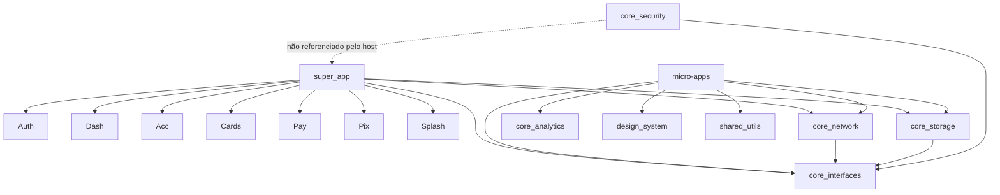

# 03 — Mapa de módulos

> Workspace Melos: `melos.yaml:L10-L15`. Host: `super_app/pubspec.yaml`. 19 `pubspec.yaml` de pacote (inclui `design_system/example`). Pasta `packages/plugins/` referenciada e **ausente**.

## Host (deployable)

| Módulo | Caminho | Responsabilidade | Dependências | Arquivos-chave |
|--------|---------|------------------|--------------|----------------|
| super_app | `super_app/` | Orquestra DI, router, theme, init eager de splash/auth, init lazy dos demais | todos os `core_*` listados **exceto** `core_security`; 7 micro-apps; `design_system`; `shared_utils`; `flutter_bloc`, `hydrated_bloc`, `get_it`, `go_router`, `dio`, `http` | `lib/main.dart`, `lib/core/di/injection_container.dart`, `lib/core/router/app_router.dart`, `lib/core/router/route_middleware.dart`, `lib/core/services/auth_service_impl.dart`, `lib/core/theme/theme_bloc.dart` |

API pública do host: `main()` (`super_app/lib/main.dart:L19-L43`). Título do `MaterialApp`: `'Premium Bank - Arquitetura Modular'` (`main.dart:L325`).

## Core

| Módulo | Caminho | Responsabilidade | Dependências | Arquivos-chave |
|--------|---------|------------------|--------------|----------------|
| core_interfaces | `packages/core/core_interfaces/` | Contratos: `MicroApp`, `BaseMicroApp`, `MicroAppDependencies`, services, `ApplicationHub`, `AppConfig`, `BlocRegistry`, exceções | só Flutter | `lib/src/micro_app.dart`, `lib/src/base_micro_app.dart`, `lib/src/application_hub/application_hub.dart`, `lib/src/config/app_config.dart` |
| core_network | `packages/core/core_network/` | `NetworkServiceImpl` + Dio, interceptors, connectivity, cache Hive | `core_interfaces`, `dio`, `http`, `connectivity_plus`, `hive` | `lib/src/network_service_impl.dart`, `lib/src/interceptors/auth_interceptor.dart`, `lib/src/interceptors/logging_interceptor.dart` |
| core_storage | `packages/core/core_storage/` | Storage local: SharedPreferences, Hive, `flutter_secure_storage` | `core_interfaces`, `shared_preferences`, `hive`, `flutter_secure_storage` | `lib/src/secure_storage_service.dart` |
| core_navigation | `packages/core/core_navigation/` | Wrapper de navegação sobre GoRouter | `core_interfaces`, `go_router` | (impl `NavigationServiceImpl` consumida em `main.dart:L300-L303`) |
| core_analytics | `packages/core/core_analytics/` | Abstração de analytics + provider console | `core_interfaces` | `lib/src/providers/console_analytics_provider.dart` |
| core_logging | `packages/core/core_logging/` | `LoggingServiceImpl` + handlers | `core_interfaces` | (registrado em `injection_container.dart:L103-L107`) |
| core_communication | `packages/core/core_communication/` | `ApplicationHubImpl` (event bus) | `core_interfaces` | `lib/src/application_hub_impl.dart` |
| core_feature_flags | `packages/core/core_feature_flags/` | Flags in-memory + defaults de produto | `core_interfaces` | `lib/src/feature_flags_service_impl.dart` |
| core_security | `packages/core/core_security/` | Secure storage, validators, crypto, biometria — **não wired no host** | `core_interfaces`, `flutter_secure_storage`, `crypto`, `encrypt`, `jwt_decoder`, `local_auth`, `device_info_plus` | `lib/src/services/secure_storage_service.dart`, `lib/src/validators/input_validator.dart` |

## Micro-apps

Cada um (exceto splash) segue CA local: `lib/src/{data,domain,presentation,di}` + `*_micro_app.dart`.

| Módulo | Caminho | Responsabilidade | Rotas (de `get routes`) | Dependências típicas | Arquivos-chave |
|--------|---------|------------------|-------------------------|----------------------|----------------|
| splash | `packages/micro_apps/splash/` | Splash inicial | `/` | `core_interfaces` | `lib/src/splash_micro_app.dart` |
| auth | `packages/micro_apps/auth/` | Login email/senha, registro, reset, stubs Google/Apple | `/login`, `/register`, `/reset-password` | core_interfaces/network/storage/analytics, design_system, shared_utils, flutter_bloc, get_it, go_router | `lib/src/auth_micro_app.dart`, `lib/src/domain/usecases/login_usecase.dart`, `lib/src/presentation/bloc/auth_bloc.dart` |
| dashboard | `packages/micro_apps/dashboard/` | Home: saldo, resumo, quick actions | `/dashboard`, `/dashboard/account`, `/dashboard/transaction/:id` | idem + `fl_chart` | `lib/src/dashboard_micro_app.dart`, `lib/src/presentation/bloc/` |
| account | `packages/micro_apps/account/` | Conta, extrato, transferência TED-like | `/account`, `/account/details`, `/account/statement`, `/account/transfer` | idem | `lib/src/account_micro_app.dart` |
| cards | `packages/micro_apps/cards/` | Listar/detalhar cartão, extrato, block/unblock | `/cards`, `/cards/:id`, `/cards/:id/statement` | idem | `lib/src/cards_micro_app.dart` |
| payments | `packages/micro_apps/payments/` | Pagamento de contas (Cubit + HydratedBloc) | `/payments`, `/payments/:id` | **só** `core_interfaces` + flutter_bloc/hydrated_bloc/get_it (sem design_system/network/storage no pubspec); **sem** pasta `di/` — monta repo/cubit à mão | `lib/src/payments_micro_app.dart`, `lib/src/presentation/cubits/payments_cubit.dart` (paralelo morto: `presentation/bloc/` e `data/sources/`) |
| pix | `packages/micro_apps/pix/` | Chaves PIX, envio, recebimento, QR | `/pix`, `/pix/keys`, `/pix/keys/register`, `/pix/send`, `/pix/receive`, `/pix/scan`, `/pix/transaction/:id` | idem + `qr_flutter`, `mobile_scanner` | `lib/src/pix_micro_app.dart`, `lib/src/domain/usecases/send_pix_usecase.dart` |

**Use cases por módulo (24 classes `*UseCase`):**

- auth: `LoginUseCase`, `LogoutUseCase`, `RegisterUseCase`, `ResetPasswordUseCase`
- dashboard: `GetAccountSummaryUseCase`, `GetTransactionSummaryUseCase`, `GetQuickActionsUseCase`
- account: `GetAccountUseCase`, `GetAccountBalanceUseCase`, `GetAccountStatementUseCase`, `TransferMoneyUseCase`
- cards: `GetCardsUseCase`, `GetCardStatementUseCase`, `BlockCardUseCase`, `UnblockCardUseCase`
- payments: `GetPaymentsUseCase`, `MakePaymentUseCase`
- pix: `GetPixKeysUseCase`, `RegisterPixKeyUseCase`, `DeletePixKeyUseCase`, `SendPixUseCase`, `ReceivePixUseCase`, `GenerateQrCodeUseCase`, `ReadQrCodeUseCase`

**Repository interfaces (domain):** `AuthRepository`, `DashboardRepository`, `AccountRepository`, `CardsRepository`, `PaymentRepository`, `PixRepository`.

## Shared

| Módulo | Caminho | Responsabilidade | Dependências | Arquivos-chave |
|--------|---------|------------------|--------------|----------------|
| design_system | `packages/shared/design_system/` | Tokens e componentes UI compartilhados | Flutter | `lib/design_system.dart`, `lib/src/molecules/inputs/bank_text_field.dart` |
| design_system/example | `packages/shared/design_system/example/` | App de showcase do DS | design_system | `lib/main.dart` |
| shared_utils | `packages/shared/shared_utils/` | Validators (senha etc.), helpers de rota | Flutter | `lib/src/validators/password_validator.dart` |

## Workspace / tooling (não é módulo de runtime)

| Módulo | Caminho | Responsabilidade |
|--------|---------|------------------|
| workspace root | `./` | `pubspec.yaml` só declara `melos: ^3.1.1`; nome `flutter_arqt_workspace` |
| Melos | `melos.yaml` | scripts `analyze`, `test`, `build_runner`, `version`, `publish` |

## Grafo de dependência (simplificado)

Não foi encontrado ciclo de path-deps entre micro-apps (nenhum micro-app depende de outro no `pubspec.yaml`).

## Arquivos-fonte desta seção

- `melos.yaml`
- `pubspec.yaml`
- `super_app/pubspec.yaml`
- `packages/core/*/pubspec.yaml`
- `packages/micro_apps/*/pubspec.yaml`
- `packages/micro_apps/*/lib/src/*_micro_app.dart`
