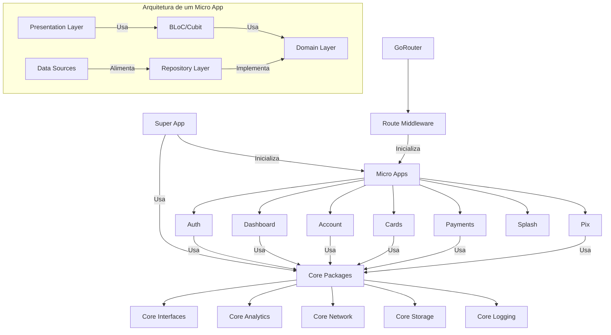

# Premium Bank - Flutter Super App (WIP)

<div align="center">

[](https://flutter.dev)
[](https://dart.dev)
[](https://github.com/cristianoaredes/super-app-flutter-sample)
[](https://bloclibrary.dev)
[](https://github.com/cristianoaredes/super-app-flutter-sample)
[](https://choosealicense.com/licenses/mit/)

[English](README_en.md) | Português

</div>

<p align="center">
  
</p>

> 🏦 Um super app bancário modular construído com Flutter, implementando uma arquitetura escalável e moderna para aplicações financeiras.

## 🌟 Destaques

- 📱 Interface moderna e intuitiva
- 🔒 Segurança e privacidade em primeiro lugar
- 🚀 Alta performance e otimização
- ♿ Acessibilidade como prioridade
- 🌐 Suporte multi-idiomas (em breve)

Este projeto implementa uma arquitetura modular para Flutter usando o conceito de micro apps, focando na inicialização sob demanda, gerenciamento do ciclo de vida dos componentes e comunicação entre módulos independentes.

## Principais Funcionalidades

- **Arquitetura Modular**: Uso de micro apps isolados e independentes
- **Inicialização Sob Demanda**: Carregamento de módulos apenas quando necessário
- **Gerenciamento de Estado Robusto**: Implementação segura com BLoC/Cubit
- **Recuperação de Falhas**: Detecção e recuperação automática de estados inválidos
- **Middleware de Rotas Inteligente**: Gerenciamento de rotas com inicialização automática de módulos

## Principais Tecnologias

- **Flutter**: 3.29.2
- **Dart**: 3.7.2
- **Gerenciamento de Estado**: bloc 8.1.6 com flutter_bloc e hydrated_bloc 9.1.5
- **Injeção de Dependência**: get_it 7.7.0
- **Navegação**: go_router 12.1.3
- **Código Gerado**: freezed 2.5.8 e json_serializable 6.8.0
- **Armazenamento**: shared_preferences 2.2.3 e path_provider 2.1.4
- **Rede**: http 1.2.2 e dio 5.3.3

## Estrutura do Projeto

O projeto está organizado em três camadas principais:

1. **Super App**: Orquestra os micro apps e fornece funcionalidades compartilhadas
2. **Micro Apps**: Implementam funcionalidades específicas de forma independente
3. **Core Packages**: Fornecem funcionalidades compartilhadas entre os micro apps

```
flutter_arqt/
├── packages/
│   ├── core/                  # Pacotes core
│   │   ├── core_analytics/    # Serviço de analytics
│   │   ├── core_interfaces/   # Interfaces compartilhadas
│   │   ├── core_network/      # Serviço de rede
│   │   ├── core_storage/      # Serviço de armazenamento
│   │   ├── core_logging/      # Serviço de logging
│   │   ├── core_feature_flags/ # Feature flags
│   │   └── core_communication/ # Comunicação entre micro apps
│   │
│   └── micro_apps/            # Micro apps
│       ├── account/           # Micro app de conta
│       ├── auth/              # Micro app de autenticação
│       ├── cards/             # Micro app de cartões
│       ├── dashboard/         # Micro app de dashboard
│       ├── payments/          # Micro app de pagamentos
│       ├── pix/               # Micro app de pix
│       └── splash/            # Micro app de splash screen
│
└── super_app/                 # Aplicação principal
    ├── lib/
    │   ├── core/              # Implementações core do super app
    │   │   ├── di/            # Injeção de dependência
    │   │   ├── router/        # Configuração de rotas
    │   │   ├── services/      # Serviços compartilhados
    │   │   ├── theme/         # Configurações de tema
    │   │   └── widgets/       # Widgets compartilhados
    │   └── main.dart          # Ponto de entrada
    └── test/                  # Testes
```

## Funcionalidades Implementadas

- **Autenticação**: Login com email/senha e credenciais mockadas
- **Dashboard**: Exibição de resumo da conta e transações
- **Pagamentos**: Gerenciamento de pagamentos
- **Pix**: Transferências Pix e gerenciamento de chaves
- **Cartões**: Gerenciamento de cartões
- **Conta**: Detalhes da conta e extrato

## Soluções Arquiteturais

### Inicialização de Micro Apps Sob Demanda

Um dos destaques deste projeto é o sistema de inicialização de micro apps sob demanda, implementado através de um middleware de rotas. Este sistema:

1. Detecta automaticamente qual micro app é necessário para uma determinada rota
2. Verifica se o micro app já está inicializado e em um estado válido
3. Inicializa o micro app se necessário, ou reinicializa em caso de estado inválido
4. Gerencia corretamente os recursos para evitar memory leaks

### Gerenciamento Robusto de Estado com BLoC/Cubit

Para resolver problemas comuns como "Cannot emit new states after calling close", implementamos um sistema robusto de gerenciamento de ciclo de vida para os Blocs e Cubits:

1. Verificação de estado dos Blocs/Cubits antes de usá-los
2. Recriação automática quando um Bloc/Cubit foi fechado
3. Tratamento adequado de exceções durante o fechamento
4. Prevenção de memory leaks

### Diagrama da Arquitetura



## Injeção de Dependências

A injeção de dependências é feita usando o pacote `get_it`. O Super App registra os serviços core e os micro apps, que por sua vez registram suas próprias dependências internas.

O sistema de DI é organizado da seguinte forma:
1. Registro de serviços core (network, storage, analytics, etc.)
2. Registro de micro apps como singletons lazy
3. Cada micro app registra suas próprias dependências quando inicializado
4. Sistema de cleanup para liberar recursos quando um micro app é descarregado

## Navegação entre Micro Apps

A navegação é implementada usando o pacote `go_router`. Cada micro app define suas próprias rotas, e o Super App as orquestra através do `AppRouter`.

Características principais:
1. Rotas aninhadas para micro apps
2. Middleware de inicialização automática
3. Sistema de recuperação de falhas
4. Gerenciamento de estado da navegação
5. Suporte a deep links
6. Transições personalizadas entre rotas

## Credenciais de Teste

Para testar a aplicação, você pode usar:

- **Email**: `user@example.com`
- **Senha**: `password`

## Como Começar

### Pré-requisitos

- Flutter 3.29.2
- Dart 3.7.2
- Java 17+ (para Android)
- Xcode 14+ (para iOS)
- Android Studio 2023.1+ ou VS Code com extensões Flutter/Dart

### Instalação

1. Clone o repositório:
   ```bash
   git clone https://github.com/cristianoaredes/super-app-flutter-sample.git
   cd super-app-flutter-sample
   ```

2. Instale as dependências:
   ```bash
   flutter pub get
   cd super_app
   flutter pub get
   ```

3. Execute o app:
   ```bash
   cd super_app
   flutter run
   ```

## Status do Projeto (WIP)

Este projeto está atualmente em desenvolvimento ativo (Work In Progress). Estamos continuamente implementando novas funcionalidades e melhorias.

## Melhorias Recentes

- **Atualização para Flutter 3.29.2**: Atualização do projeto para a última versão estável do Flutter.
- **Atualização de Dependências**: Atualização de todas as dependências para as versões mais recentes compatíveis.
- **Compatibilidade com Java 17+**: Configuração do projeto para ser compatível com Java 17 e versões superiores.
- **Correção do erro "Cannot emit new states after calling close"**: Implementação de um sistema robusto para gerenciar o ciclo de vida do Bloc/Cubit e prevenir emissão de estados após o fechamento.
- **Middleware de inicialização automática**: Criação de um middleware de rota que inicializa automaticamente os micro apps sob demanda.
- **Recuperação de estados inválidos**: Adição de mecanismos para detectar e recuperar de estados inválidos de micro apps.
- **Renomeado para Premium Bank**: Mudança do nome do app para "Premium Bank" em todas as plataformas.
- **Adição de permissões**: Adição de permissões necessárias para câmera, armazenamento, localização e biometria.

## Próximos Passos

- Adicionar testes unitários e de widget
- Implementar CI/CD com GitHub Actions
- Adicionar autenticação biométrica
- Implementar suporte a tema claro/escuro
- Melhorar a responsividade da interface
- Implementar integração com API real

## Screenshots

<table>
  <tr>
    <td align="center"><b>Login</b></td>
    <td align="center"><b>Dashboard</b></td>
    <td align="center"><b>Menu</b></td>
    <td align="center"><b>Lista de Cartões</b></td>
    <td align="center"><b>Detalhes do Cartão</b></td>
  </tr>
  <tr>
    <td></td>
    <td></td>
    <td></td>
    <td></td>
    <td></td>
  </tr>
  <tr>
    <td align="center"><b>Área Pix</b></td>
    <td align="center"><b>Transferência Pix</b></td>
    <td align="center"><b>Chaves Pix</b></td>
    <td align="center"><b>Pagamentos</b></td>
    <td align="center"><b>Novo Pagamento</b></td>
  </tr>
  <tr>
    <td></td>
    <td></td>
    <td></td>
    <td></td>
    <td></td>
  </tr>
</table>

## 🔍 Palavras-chave
`flutter` `dart` `super-app` `fintech` `mobile-banking` `bloc-pattern` `clean-architecture` `modular-architecture` `dependency-injection` `micro-apps` `flutter-banking` `mobile-development` `flutter-example` `flutter-template` `banking-app` `flutter-architecture` `flutter-best-practices` `flutter-patterns` `flutter-clean-code` `flutter-modular`

## 📊 Métricas do Projeto

[](https://github.com/cristianoaredes/super-app-flutter-sample/stargazers)
[](https://github.com/cristianoaredes/super-app-flutter-sample/network/members)
[](https://github.com/cristianoaredes/super-app-flutter-sample/issues)

## 🤝 Mantenedores

<table>
  <tr>
    <td align="center">
      <a href="https://github.com/cristianoaredes">
        <br>
        <sub>
          <b>Cristiano Aredes</b>
        </sub>
      </a>
    </td>
  </tr>
</table>

## 📫 Contato

Para sugestões, dúvidas ou contribuições:

- 📧 Email: cristiano@aredes.me
- 💼 LinkedIn: [Cristiano Aredes](https://www.linkedin.com/in/cristianoaredes/)

## ⭐ Mostre seu apoio

Se este projeto te ajudou de alguma forma, considere:

- ⭐ Dar uma estrela no GitHub
- 🐛 Reportar bugs ou sugerir melhorias em [Issues](https://github.com/cristianoaredes/super-app-flutter-sample/issues)
- 🔀 Fazer um fork e contribuir com o projeto
- 📢 Compartilhar com outros desenvolvedores

## 📝 Citação

Se você usar este projeto como referência em artigos ou estudos, por favor cite:

```bibtex
@software{premium_bank_flutter,
  author = {Cristiano Aredes},
  title = {Premium Bank - Flutter Super App},
  year = {2024},
  publisher = {GitHub},
  url = {https://github.com/cristianoaredes/super-app-flutter-sample}
}
```

---
<div align="center">
  Feito com ❤️ por <a href="https://github.com/cristianoaredes">Cristiano Aredes</a>
</div>
