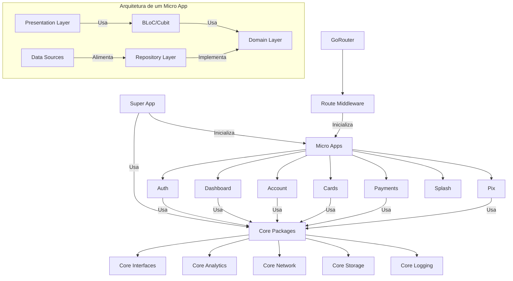

# Premium Bank - Flutter Super App (WIP)

<p align="center">
  
  
  
  
  
</p>

Este projeto implementa uma arquitetura modular para Flutter usando o conceito de micro apps, com foco na inicialização sob demanda, gerenciamento de ciclo de vida de componentes e comunicação entre módulos independentes.

## Características Principais

- **Arquitetura Modular**: Uso de micro apps isolados e independentes
- **Inicialização Sob Demanda**: Carregamento de módulos apenas quando necessário
- **Gerenciamento de Estado Robusto**: Implementação segura com BLoC/Cubit
- **Recuperação de Falhas**: Detecção e recuperação automática de estados inválidos
- **Middleware de Rota Inteligente**: Gestão de rotas com inicialização automática de módulos

## Tecnologias Principais

- **Flutter**: 3.29.2
- **Dart**: 3.7.2
- **Gerenciamento de Estado**: bloc 8.1.6 com flutter_bloc e hydrated_bloc 9.1.5
- **Injeção de Dependência**: get_it 7.7.0
- **Navegação**: go_router 12.1.3
- **Código Gerado**: freezed 2.5.8 e json_serializable 6.8.0
- **Armazenamento**: shared_preferences 2.2.3 e path_provider 2.1.4
- **Rede**: http 1.2.2 e dio 5.3.3

## Estrutura do Projeto

O projeto é organizado em três camadas principais:

1. **Super App**: Orquestra os micro apps e fornece funcionalidades compartilhadas
2. **Micro Apps**: Implementam funcionalidades específicas de forma independente
3. **Pacotes Core**: Fornecem funcionalidades compartilhadas entre os micro apps

```
flutter_arqt/
├── packages/
│   ├── core/                  # Pacotes core
│   │   ├── core_analytics/    # Serviço de analytics
│   │   ├── core_interfaces/   # Interfaces compartilhadas
│   │   ├── core_network/      # Serviço de rede
│   │   ├── core_storage/      # Serviço de armazenamento
│   │   ├── core_logging/      # Serviço de logging
│   │   ├── core_feature_flags/ # Feature flags
│   │   └── core_communication/ # Comunicação entre micro apps
│   │
│   └── micro_apps/            # Micro apps
│       ├── account/           # Micro app de conta
│       ├── auth/              # Micro app de autenticação
│       ├── cards/             # Micro app de cartões
│       ├── dashboard/         # Micro app de dashboard
│       ├── payments/          # Micro app de pagamentos
│       ├── pix/               # Micro app de Pix
│       └── splash/            # Micro app de splash screen
│
└── super_app/                 # Aplicativo principal
    ├── lib/
    │   ├── core/              # Implementações core do super app
    │   │   ├── di/            # Injeção de dependências
    │   │   ├── router/        # Configuração de rotas
    │   │   ├── services/      # Serviços compartilhados
    │   │   ├── theme/         # Configurações de tema
    │   │   └── widgets/       # Widgets compartilhados
    │   └── main.dart          # Ponto de entrada
    └── test/                  # Testes
```

## Funcionalidades Implementadas

- **Autenticação**: Login com email/senha e credenciais mockadas
- **Dashboard**: Exibição de sumário de contas e transações
- **Payments**: Gerenciamento de pagamentos
- **Pix**: Transferências via Pix e gestão de chaves
- **Cards**: Gerenciamento de cartões
- **Account**: Detalhes e extrato da conta

## Soluções Arquiteturais

### Inicialização de Micro Apps Sob Demanda

Um dos destaques deste projeto é o sistema de inicialização de micro apps sob demanda, implementado através de um middleware de rotas. Este sistema:

1. Detecta automaticamente qual micro app é necessário para uma determinada rota
2. Verifica se o micro app já está inicializado e em um estado válido
3. Inicializa o micro app se necessário, ou reinicializa em caso de estado inválido
4. Gerencia corretamente os recursos para evitar memory leaks

```dart
// Exemplo do middleware que inicializa micro apps sob demanda
class MicroAppInitializerMiddleware {
  // ...

  FutureOr<String?> redirect(BuildContext context, GoRouterState state) async {
    final path = state.matchedLocation;
    final microAppName = _getMicroAppNameForRoute(path);

    if (microAppName != null) {
      // Se este micro app está sendo reinicializado, redirecione para o dashboard
      if (_microAppsBeingReinitialized.contains(microAppName)) {
        return '/dashboard';
      }

      try {
        final microApp = _getIt<MicroApp>(instanceName: microAppName);

        // Verifica se o micro app está em um estado válido
        if (microApp.isInitialized) {
          try {
            microApp.build(context);
            return null; // Continue para a rota original
          } catch (e) {
            // O micro app está em estado inválido, necessita reinicialização
            needsReinitialization = true;
          }
        }

        // Inicializa ou reinicializa o micro app
        if (!microApp.isInitialized || needsReinitialization) {
          // Processo de inicialização...
        }

        return null;
      } catch (e) {
        return '/error';
      }
    }

    return null;
  }
}
```

### Gerenciamento Robusto de Estado com BLoC/Cubit

Para resolver problemas comuns como "Cannot emit new states after calling close", implementamos um sistema robusto de gerenciamento de ciclo de vida para os Blocs e Cubits:

1. Verificação de estado dos Blocs/Cubits antes de usá-los
2. Recriação automática quando um Bloc/Cubit foi fechado
3. Tratamento adequado de exceções durante o fechamento
4. Prevenção de memory leaks

```dart
// Exemplo de correção para o problema "Cannot emit new states after calling close"
void _fetchPaymentsSafely() {
  try {
    if (mounted) {
      final cubit = context.read<PaymentsCubit>();

      // Verificar se o estado atual é válido (não está fechado)
      cubit.state;

      // Se chegou aqui, o cubit está em um estado válido
      cubit.fetchPayments();
    }
  } catch (e) {
    debugPrint('Erro ao carregar pagamentos: $e');
    // Não propagamos o erro para evitar crash da UI
  }
}
```

### Diagrama da Arquitetura



## Injeção de Dependências

A injeção de dependências é feita usando o pacote `get_it`. O Super App registra os serviços core e os micro apps, que por sua vez registram suas próprias dependências internas.

```dart
// Exemplo de registro de dependências no Super App
void _registerCoreServices() {
  sl.registerLazySingleton<NetworkService>(
    () => NetworkServiceImpl(),
  );

  sl.registerLazySingleton<StorageService>(
    () => kIsWeb ? WebStorageService() : StorageServiceImpl(),
  );

  // Mais registros...
}

void _registerMicroApps() {
  sl.registerLazySingleton<MicroApp>(
    () => PaymentsMicroApp(),
    instanceName: 'payments',
  );

  sl.registerLazySingleton<MicroApp>(
    () => PixMicroApp(),
    instanceName: 'pix',
  );

  // Outros micro apps...
}
```

## Navegação entre Micro Apps

A navegação é implementada usando o pacote `go_router`. Cada micro app define suas próprias rotas, e o Super App as orquestra através do `AppRouter`.

```dart
// Exemplo de configuração de rotas
GoRouter _createRouter() {
  return GoRouter(
    navigatorKey: _rootNavigatorKey,
    initialLocation: '/',
    debugLogDiagnostics: true,
    redirect: _microAppInitializer.redirect,
    routes: [
      // Rota inicial
      GoRoute(
        path: '/',
        builder: (context, state) => const SplashPage(),
      ),

      // Página de erro
      GoRoute(
        path: '/error',
        builder: (context, state) => const ErrorPage(),
      ),

      // Rotas dos micro apps
      ..._getMicroAppRoutes(),
    ],
    errorBuilder: _buildErrorPage,
    observers: _observers,
  );
}
```

## Credenciais de Teste

Para testar o aplicativo, você pode usar:

- **Email**: `user@example.com`
- **Senha**: `password`

## Começando

### Pré-requisitos

- Flutter 3.29.2
- Dart 3.7.2
- Java 17+ (para Android)
- Xcode 14+ (para iOS)
- Android Studio 2023.1+ ou VS Code com extensões Flutter/Dart

### Instalação

1. Clone o repositório:
   ```bash
   git clone https://github.com/cristianoaredes/super-app-flutter-sample.git
   cd super-app-flutter-sample
   ```

2. Instale as dependências:
   ```bash
   flutter pub get
   cd super_app
   flutter pub get
   ```

3. Execute o aplicativo:
   ```bash
   cd super_app
   flutter run
   ```

## Status do Projeto (WIP)

Este projeto está atualmente em desenvolvimento ativo (Work In Progress). Estamos implementando novas funcionalidades e melhorias continuamente.

## Melhorias Recentes

- **Atualização para Flutter 3.29.2**: Atualizamos o projeto para a versão mais recente e estável do Flutter.
- **Atualização das Dependências**: Atualizamos todas as dependências para as versões mais recentes compatíveis.
- **Compatibilidade com Java 17+**: Configuramos o projeto para ser compatível com o Java 17 e versões superiores.
- **Correção do erro "Cannot emit new states after calling close"**: Implementamos um sistema robusto para gerenciar o ciclo de vida dos Blocs/Cubits e prevenir emissão de estados após fechamento.
- **Middleware de inicialização automática**: Criamos um middleware de rotas que inicializa automaticamente os micro apps sob demanda.
- **Recuperação de estados inválidos**: Adicionamos mecanismos para detectar e recuperar de estados inválidos de micro apps.
- **Mudança de nome para Premium Bank**: Alteramos o nome do aplicativo para "Premium Bank" em todas as plataformas.
- **Adição de permissões**: Adicionamos permissões necessárias para câmera, armazenamento, localização e biometria.

## Próximos Passos

- Adicionar testes unitários e de widget
- Implementar CI/CD com GitHub Actions
- Adicionar autenticação biométrica
- Implementar suporte a temas claros/escuros
- Melhorar a responsividade da interface
- Implementar integração com APIs reais

## Contribuindo

1. Faça um fork do projeto
2. Crie uma branch para sua feature (`git checkout -b feature/nova-feature`)
3. Faça commit das suas mudanças (`git commit -m 'Adiciona nova feature'`)
4. Faça push para a branch (`git push origin feature/nova-feature`)
5. Abra um Pull Request

## Licença

Este projeto está licenciado sob a licença MIT - veja o arquivo LICENSE para detalhes.

## Screenshots do App

### Fluxo Principal
<div align="center">
  <div style="display: flex; align-items: flex-start; justify-content: center;">
    
    
    
  </div>
</div>

### Cartões
<div align="center">
  <div style="display: flex; align-items: flex-start; justify-content: center;">
    
    
  </div>
</div>

### Área Pix
<div align="center">
  <div style="display: flex; align-items: flex-start; justify-content: center;">
    
    
    
  </div>
</div>

### Pagamentos
<div align="center">
  <div style="display: flex; align-items: flex-start; justify-content: center;">
    
    
  </div>
</div>
