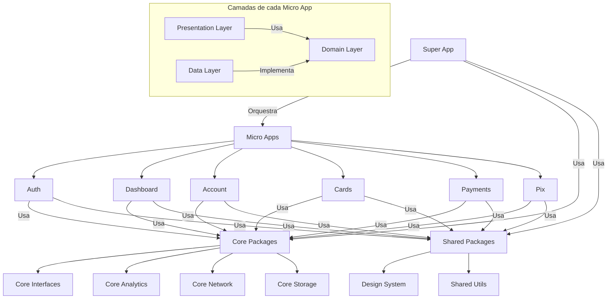

# Premium Bank - Arquitetura Modular Flutter

<p align="center">
  
  
  
  
</p>

Este projeto implementa um aplicativo bancário premium com arquitetura modular para Flutter, seguindo os princípios de Clean Architecture e utilizando micro apps para organizar as funcionalidades. O design utiliza um tema premium com cores preto e dourado para transmitir sofisticação e exclusividade.

## Tecnologias Principais

- **Flutter**: Versão estável mais recente (3.19+)
- **Dart**: 3.3+
- **Gerenciamento de Estado**: bloc 8.0+ com hydrated_bloc e Cubit
- **Gerenciamento de Pacotes**: Melos para orquestração multi-repo
- **Geração de Código**: build_runner com freezed e json_serializable
- **Navegação**: go_router para deep linking e navegação
- **Injeção de Dependência**: get_it para localização de serviços

## Estrutura do Projeto

O projeto é organizado em três camadas principais:

1. **Super App**: Orquestra os micro apps e fornece funcionalidades compartilhadas.
2. **Micro Apps**: Implementam funcionalidades específicas de forma independente.
3. **Pacotes Core e Shared**: Fornecem funcionalidades compartilhadas entre os micro apps.

```
flutter_arqt/
├── packages/
│   ├── core/                  # Pacotes core
│   │   ├── core_analytics/    # Serviço de analytics
│   │   ├── core_interfaces/   # Interfaces compartilhadas
│   │   ├── core_network/      # Serviço de rede
│   │   └── core_storage/      # Serviço de armazenamento
│   │
│   ├── micro_apps/            # Micro apps
│   │   ├── account/           # Micro app de conta
│   │   ├── auth/              # Micro app de autenticação
│   │   ├── cards/             # Micro app de cartões
│   │   ├── dashboard/         # Micro app de dashboard
│   │   ├── payments/          # Micro app de pagamentos
│   │   └── pix/               # Micro app de Pix
│   │
│   └── shared/                # Pacotes compartilhados
│       ├── design_system/     # Design system
│       └── shared_utils/      # Utilitários compartilhados
│
└── super_app/                 # Aplicativo principal
```

## Funcionalidades Principais

- **Autenticação Segura**: Login com email/senha e opções de login social
- **Dashboard Personalizado**: Visão geral das finanças com resumo de conta e transações recentes
- **Transferências e Pagamentos**: Transferências entre contas e pagamento de contas
- **Pix**: Transferências instantâneas via Pix
- **Gestão de Cartões**: Visualização e gerenciamento de cartões de crédito e débito
- **Extrato da Conta**: Histórico detalhado de transações

## Design Premium

O aplicativo utiliza um tema premium com as seguintes características:

- **Cores**: Preto e dourado para transmitir sofisticação e exclusividade
- **Tema Escuro**: Configurado como padrão para uma experiência visual premium
- **Interface Limpa**: Tela de login sem barra de navegação para uma experiência imersiva
- **Ícones Destacados**: Botões de login social com fundo dourado para destaque visual

## Arquitetura

A arquitetura do projeto segue os princípios de Clean Architecture, com as seguintes camadas:

1. **Domain**: Contém as entidades, casos de uso e interfaces de repositórios.
2. **Data**: Implementa os repositórios e fontes de dados.
3. **Presentation**: Implementa a interface do usuário e a lógica de apresentação.

Cada micro app segue essa estrutura, garantindo a independência e a testabilidade.

### Diagrama da Arquitetura



## Comunicação entre Micro Apps

A comunicação entre os micro apps é feita através de interfaces definidas no pacote `core_interfaces`. Os micro apps não dependem diretamente uns dos outros, apenas das interfaces.

## Injeção de Dependências

A injeção de dependências é feita usando o pacote `get_it`. Cada micro app registra suas próprias dependências, e o Super App orquestra a inicialização.

## Navegação

A navegação é feita usando o pacote `go_router`. Cada micro app define suas próprias rotas, e o Super App orquestra a navegação entre os micro apps.

## Gerenciamento de Estado

O gerenciamento de estado é feito usando o pacote `flutter_bloc`. Cada micro app define seus próprios blocs, e o Super App orquestra o estado global.

## Design System

O design system é implementado no pacote `design_system` e fornece componentes compartilhados entre os micro apps.

## Começando

### Pré-requisitos

- Flutter 3.19+
- Dart 3.3+
- Melos (`dart pub global activate melos`)

### Configuração

1. Clone o repositório:
   ```bash
   git clone https://github.com/seu-usuario/flutter_arqt.git
   cd flutter_arqt
   ```

2. Configure os pacotes com Melos:
   ```bash
   melos bootstrap
   ```

3. Gere o código:
   ```bash
   melos run build_runner
   ```

4. Execute o aplicativo:
   ```bash
   cd super_app
   flutter run
   ```

### Credenciais de Teste

Para testar o aplicativo, use as seguintes credenciais:

- **Email**: `user@example.com`
- **Senha**: `password`

Além disso, você pode usar os botões de login social (Google, Apple, Facebook) para simular o login com essas plataformas.

## Dados de Demonstração

O aplicativo utiliza dados simulados (mock data) para demonstrar as funcionalidades:

- **Contas**: Conta corrente e poupança com saldos simulados
- **Transações**: Histórico de transações simuladas
- **Cartões**: Cartões de crédito e débito simulados
- **Pix**: Chaves Pix e transações Pix simuladas

Em um ambiente de produção, esses dados seriam obtidos de uma API real.

## Melhorias Futuras

- **Biometria**: Implementação de autenticação biométrica
- **Notificações Push**: Alertas para transações e atividades da conta
- **Investimentos**: Módulo para gestão de investimentos
- **Suporte ao Cliente**: Chat integrado para suporte
- **Personalização**: Opções de personalização do tema e da interface

## Fluxo de Desenvolvimento

1. Desenvolva MicroApps de forma independente seguindo a estrutura de Clean Architecture
2. Use Melos para gerenciar dependências e versões
3. Execute testes em todos os pacotes com `melos run test`
4. Integre os MicroApps no Super App através das interfaces definidas

## Testes

O projeto inclui testes em vários níveis:

1. **Testes Unitários**: Testam a lógica de negócios e os casos de uso
2. **Testes de Widget**: Testam os componentes de UI
3. **Testes de Integração**: Testam a integração entre os micro apps

Para executar os testes:

```bash
melos run test
```

## CI/CD

O projeto inclui configuração para GitHub Actions que:

1. Executa análise estática e testes
2. Constrói versões para Android e iOS
3. Publica pacotes no servidor pub privado

## Contribuindo

1. Crie um fork do repositório
2. Crie uma branch para sua feature (`git checkout -b feature/nova-feature`)
3. Faça commit das suas mudanças (`git commit -m 'Adiciona nova feature'`)
4. Envie para a branch (`git push origin feature/nova-feature`)
5. Abra um Pull Request

## Licença

Este projeto está licenciado sob a licença MIT - veja o arquivo LICENSE para detalhes.
# super-app-flutter-sample
