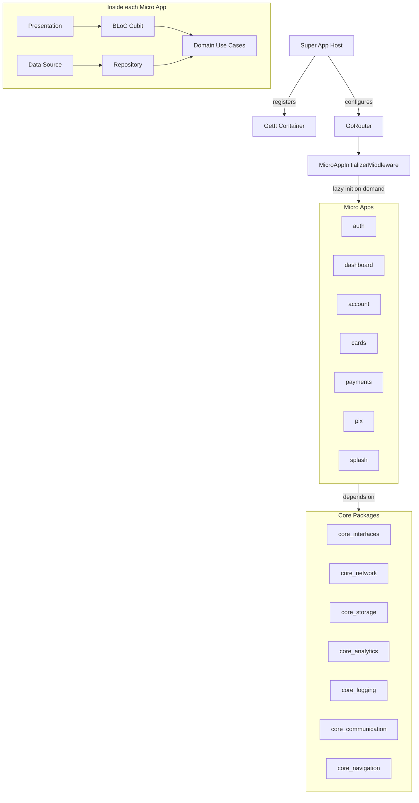
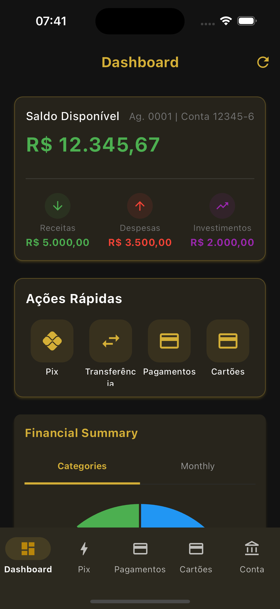
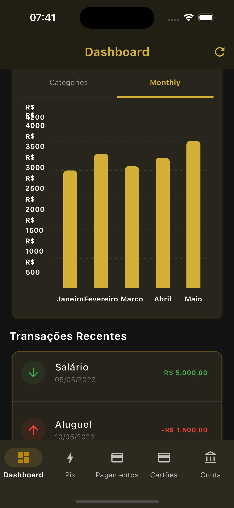
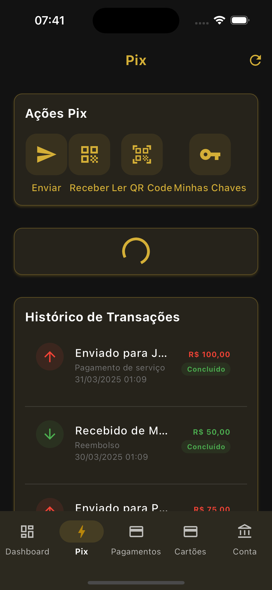
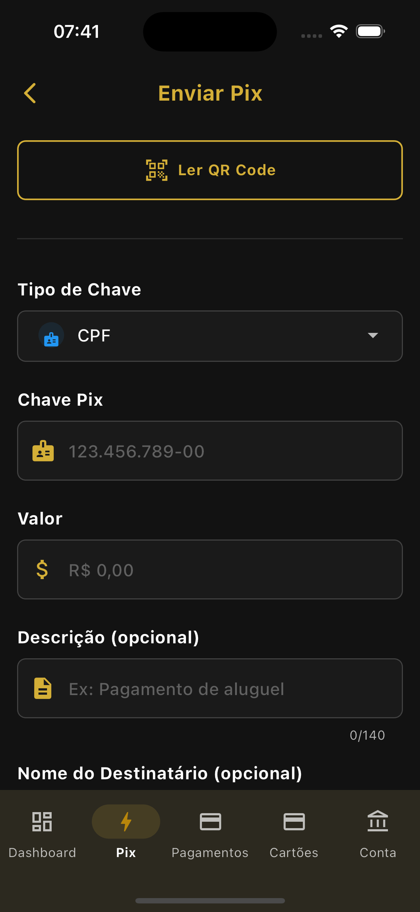
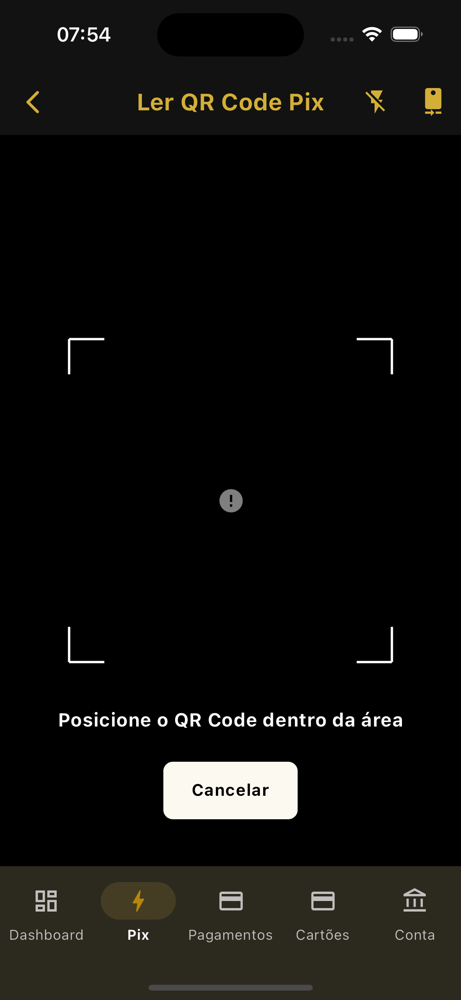
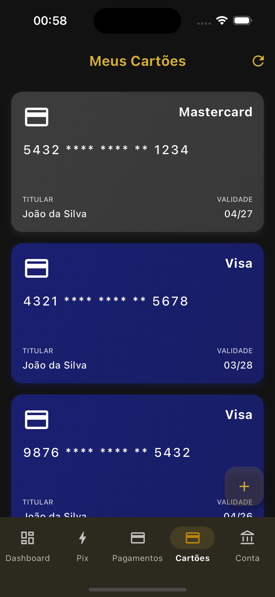
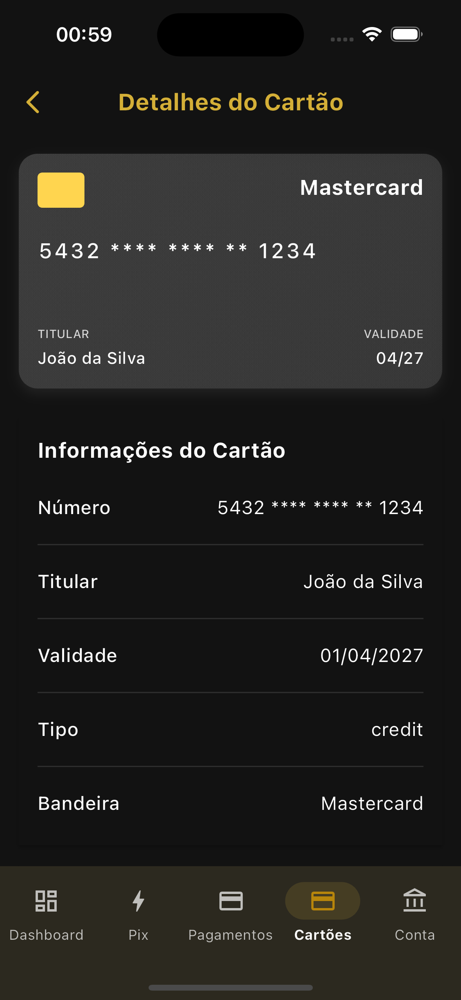

# Flutter Super App — Modular Architecture Sample with BLoC, GoRouter & GetIt

<div align="center">

[](https://flutter.dev)
[](https://dart.dev)
[](https://github.com/cristianoaredes/super-app-flutter-sample)
[](https://bloclibrary.dev)
[](https://choosealicense.com/licenses/mit/)
[](https://github.com/cristianoaredes/super-app-flutter-sample/stargazers)

</div>

<p align="center">
  
</p>

A **reference architecture** for building Flutter super apps using micro-apps, GoRouter, GetIt, and BLoC/Cubit. Clone it, study it, and use it as the foundation for your next scalable Flutter project.

---

## What is this?

This is a **sample / reference project** — not a production app. It demonstrates how to structure a large-scale Flutter application as a collection of independent micro-apps, each with its own BLoC/Cubit state management, dependency injection scope, and routing configuration.

The concrete example is a banking super app called **Premium Bank**, which bundles features (Auth, Dashboard, Payments, Pix, Cards, Account) as isolated Flutter packages orchestrated by a thin host app.

> If you are looking for a proven starting point for **Flutter modular architecture**, **Flutter super app**, or **micro apps in Flutter** — this is it.

---

## Architecture Overview

The project is organized in three layers:

```
super-app-flutter-sample/
├── packages/
│   ├── core/                    # Shared infrastructure packages
│   │   ├── core_analytics/      # Analytics abstraction
│   │   ├── core_communication/  # Event bus / inter-micro-app messaging
│   │   ├── core_feature_flags/  # Feature flag service
│   │   ├── core_interfaces/     # Shared contracts (MicroApp, Services, etc.)
│   │   ├── core_logging/        # Logging service
│   │   ├── core_navigation/     # Navigation service (GoRouter wrapper)
│   │   ├── core_network/        # HTTP client abstraction (Dio)
│   │   ├── core_security/       # Optional security kit (not wired in the host)
│   │   └── core_storage/        # Persistent storage (SharedPreferences)
│   │
│   ├── micro_apps/              # Feature packages — each is an independent module
│   │   ├── account/             # Account details and statement
│   │   ├── auth/                # Login / authentication flow
│   │   ├── cards/               # Credit/debit card management
│   │   ├── dashboard/           # Home screen and account summary
│   │   ├── payments/            # Bill payments
│   │   ├── pix/                 # Pix transfers and key management
│   │   └── splash/              # Splash screen
│   │
│   └── shared/
│       ├── design_system/       # Shared UI components and theme tokens
│       └── shared_utils/        # Utility functions
│
└── super_app/                   # Host application
    └── lib/
        ├── core/
        │   ├── di/              # GetIt registration (injection_container.dart)
        │   ├── router/          # GoRouter config + route middleware
        │   ├── services/        # Concrete service implementations
        │   ├── theme/           # Light/dark ThemeBloc
        │   └── widgets/         # Shared widgets
        └── main.dart            # Entry point — wires everything together
```

### Architecture Diagram


```mermaid
graph TD
    SuperApp[Super App Host] --> |registers| DI[GetIt Container]
    SuperApp --> |configures| Router[GoRouter]

    Router --> Middleware[MicroAppInitializerMiddleware]
    Middleware --> |lazy init on demand| MicroApps

    subgraph MicroApps[Micro Apps]
        Auth[auth]
        Dashboard[dashboard]
        Account[account]
        Cards[cards]
        Payments[payments]
        Pix[pix]
        Splash[splash]
    end

    subgraph "Inside each Micro App"
        UI[Presentation] --> BLoC["BLoC Cubit"]
        BLoC --> Domain["Domain Use Cases"]
        Repo[Repository] --> Domain
        DS[Data Source] --> Repo
    end

    MicroApps --> |depends on| Core
    subgraph Core[Core Packages]
        CoreInterfaces[core_interfaces]
        CoreNetwork[core_network]
        CoreStorage[core_storage]
        CoreAnalytics[core_analytics]
        CoreLogging[core_logging]
        CoreComm[core_communication]
        CoreNav[core_navigation]
    end
```

---

## What This Sample Demonstrates

- **Micro-app pattern** — each feature is an isolated Dart package with its own dependencies, BLoC/Cubit, and routes.
- **On-demand initialization** — a `MicroAppInitializerMiddleware` (GoRouter redirect hook) detects which micro-app a route belongs to and initializes it only when the user navigates there.
- **Lazy singleton DI with GetIt** — micro-apps are registered as lazy singletons and each registers its own internal dependencies when initialized.
- **Robust BLoC/Cubit lifecycle** — automatic health checks, re-initialization on invalid state, and proper disposal to prevent "Cannot emit new states after calling close" errors.
- **GoRouter with nested routes** — each micro-app declares its own `RouteBase` list; the host `AppRouter` merges them.
- **Inter-micro-app communication** — `ApplicationHub` / `core_communication` event bus decouples modules.
- **Feature flags** — `core_feature_flags` provides a runtime toggle service consumed by micro-apps.
- **Shared design system** — a `design_system` package keeps UI tokens consistent across all micro-apps.
- **Theme management** — `ThemeBloc` handles light/dark switching at the host level.

---

## Implemented Features

| Feature | Status | Description |
|---|---|---|
| Authentication | Done | Email/password login with mocked credentials |
| Dashboard | Done | Account summary and recent transactions |
| Payments | Done | Bill payment management |
| Pix | Done | Transfers and Pix key management |
| Cards | Done | Credit/debit card listing and details |
| Account | Done | Account details and statement |
| Deep links | Done | GoRouter-based deep link support |
| Custom route transitions | Done | Per-route animated transitions |

---

## Getting Started

### Prerequisites

- Flutter 3.29.2
- Dart 3.7.2
- Java 17+ (Android builds)
- Xcode 14+ (iOS builds)
- Android Studio 2023.1+ or VS Code with Flutter/Dart extensions

### Install and Run

```bash
# 1. Clone the repository
git clone https://github.com/cristianoaredes/super-app-flutter-sample.git
cd super-app-flutter-sample

# 2. Install root workspace dependencies
flutter pub get

# 3. Install the host app dependencies
cd super_app
flutter pub get

# 4. Run the app
flutter run
```

### Test Credentials

| Field | Value |
|---|---|
| Email | `user@example.com` |
| Password | `password` |

---

## Screenshots

<table>
  <tr>
    <td align="center"><b>Login</b></td>
    <td align="center"><b>Dashboard</b></td>
    <td align="center"><b>Menu</b></td>
    <td align="center"><b>Cards</b></td>
    <td align="center"><b>Card Details</b></td>
  </tr>
  <tr>
    <td></td>
    <td></td>
    <td></td>
    <td></td>
    <td></td>
  </tr>
  <tr>
    <td align="center"><b>Pix Area</b></td>
    <td align="center"><b>Pix Transfer</b></td>
    <td align="center"><b>Pix Keys</b></td>
    <td align="center"><b>Payments</b></td>
    <td align="center"><b>New Payment</b></td>
  </tr>
  <tr>
    <td></td>
    <td></td>
    <td></td>
    <td></td>
    <td></td>
  </tr>
</table>

---

## Key Dependencies

| Package | Version | Purpose |
|---|---|---|
| `flutter_bloc` | 8.1.6 | BLoC / Cubit state management |
| `hydrated_bloc` | 9.1.5 | Persistent BLoC state across restarts |
| `get_it` | 7.7.0 | Service locator / dependency injection |
| `go_router` | 12.1.3 | Declarative routing with deep link support |
| `freezed` | 2.5.8 | Immutable value objects and union types |
| `json_serializable` | 6.8.0 | JSON code generation |
| `dio` | 5.3.3 | HTTP client with interceptors |
| `shared_preferences` | 2.2.3 | Key-value persistent storage |

---

## Contributing

Contributions are welcome. See [CONTRIBUTING.md](CONTRIBUTING.md) for guidelines.

---

## License

MIT — see [LICENSE](LICENSE) for details.

---

## Author

Built by [Cristiano Aredes](https://github.com/cristianoaredes).

- LinkedIn: [cristianoaredes](https://www.linkedin.com/in/cristianoaredes/)
- Email: cristiano@aredes.me

---

<!-- SEO: Flutter super app, Flutter architecture, micro apps Flutter, GoRouter Flutter, GetIt Flutter, BLoC Flutter, Flutter modular architecture, Flutter clean architecture, Flutter banking app, Flutter reference architecture -->
