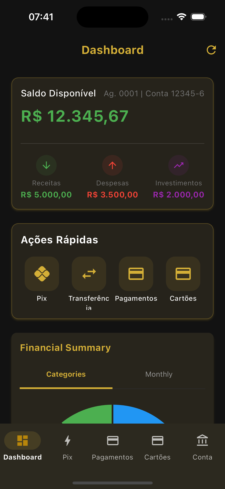
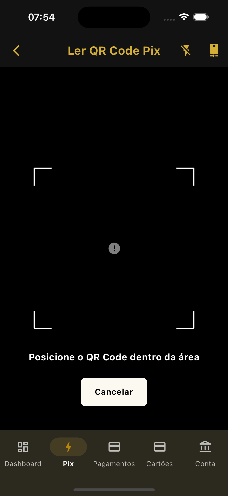
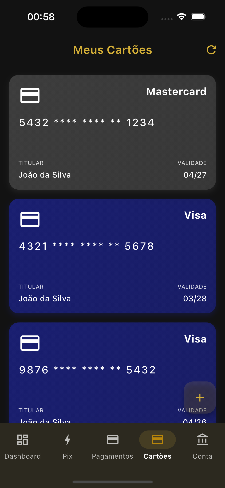
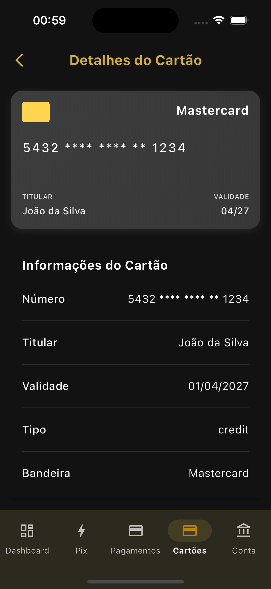

# Premium Bank - Flutter Super App (WIP)

<div align="center">

[](https://flutter.dev)
[](https://dart.dev)
[](https://github.com/cristianoaredes/super-app-flutter-sample)
[](https://bloclibrary.dev)
[](https://github.com/cristianoaredes/super-app-flutter-sample)
[](https://choosealicense.com/licenses/mit/)

[English](README_en.md) | Português

</div>

<p align="center">
  
</p>

> 🏦 Um super app bancário modular construído com Flutter, implementando uma arquitetura escalável e moderna para aplicações financeiras.

## 🌟 Destaques

- 📱 Interface moderna e intuitiva
- 🔒 Segurança e privacidade em primeiro lugar
- 🚀 Alta performance e otimização
- ♿ Acessibilidade como prioridade
- 🌐 Suporte multi-idiomas (em breve)

Este projeto implementa uma arquitetura modular para Flutter usando o conceito de micro apps, focando na inicialização sob demanda, gerenciamento do ciclo de vida dos componentes e comunicação entre módulos independentes.

## Principais Funcionalidades

- **Arquitetura Modular**: Uso de micro apps isolados e independentes
- **Inicialização Sob Demanda**: Carregamento de módulos apenas quando necessário
- **Gerenciamento de Estado Robusto**: Implementação segura com BLoC/Cubit
- **Recuperação de Falhas**: Detecção e recuperação automática de estados inválidos
- **Middleware de Rotas Inteligente**: Gerenciamento de rotas com inicialização automática de módulos

## Principais Tecnologias

- **Flutter**: 3.29.2
- **Dart**: 3.7.2
- **Gerenciamento de Estado**: bloc 8.1.6 com flutter_bloc e hydrated_bloc 9.1.5
- **Injeção de Dependência**: get_it 7.7.0
- **Navegação**: go_router 12.1.3
- **Código Gerado**: freezed 2.5.8 e json_serializable 6.8.0
- **Armazenamento**: shared_preferences 2.2.3 e path_provider 2.1.4
- **Rede**: http 1.2.2 e dio 5.3.3

## Estrutura do Projeto

O projeto está organizado em três camadas principais:

1. **Super App**: Orquestra os micro apps e fornece funcionalidades compartilhadas
2. **Micro Apps**: Implementam funcionalidades específicas de forma independente
3. **Core Packages**: Fornecem funcionalidades compartilhadas entre os micro apps

```
flutter_arqt/
├── packages/
│   ├── core/                  # Pacotes core
│   │   ├── core_analytics/    # Serviço de analytics
│   │   ├── core_interfaces/   # Interfaces compartilhadas
│   │   ├── core_network/      # Serviço de rede
│   │   ├── core_storage/      # Serviço de armazenamento
│   │   ├── core_logging/      # Serviço de logging
│   │   ├── core_feature_flags/ # Feature flags
│   │   └── core_communication/ # Comunicação entre micro apps
│   │
│   └── micro_apps/            # Micro apps
│       ├── account/           # Micro app de conta
│       ├── auth/              # Micro app de autenticação
│       ├── cards/             # Micro app de cartões
│       ├── dashboard/         # Micro app de dashboard
│       ├── payments/          # Micro app de pagamentos
│       ├── pix/               # Micro app de pix
│       └── splash/            # Micro app de splash screen
│
└── super_app/                 # Aplicação principal
    ├── lib/
    │   ├── core/              # Implementações core do super app
    │   │   ├── di/            # Injeção de dependência
    │   │   ├── router/        # Configuração de rotas
    │   │   ├── services/      # Serviços compartilhados
    │   │   ├── theme/         # Configurações de tema
    │   │   └── widgets/       # Widgets compartilhados
    │   └── main.dart          # Ponto de entrada
    └── test/                  # Testes
```

## Funcionalidades Implementadas

- **Autenticação**: Login com email/senha e credenciais mockadas
- **Dashboard**: Exibição de resumo da conta e transações
- **Pagamentos**: Gerenciamento de pagamentos
- **Pix**: Transferências Pix e gerenciamento de chaves
- **Cartões**: Gerenciamento de cartões
- **Conta**: Detalhes da conta e extrato

## Credenciais de Teste

Para testar a aplicação, você pode usar:

- **Email**: `user@example.com`
- **Senha**: `password`

## Como Começar

### Pré-requisitos

- Flutter 3.29.2
- Dart 3.7.2
- Java 17+ (para Android)
- Xcode 14+ (para iOS)
- Android Studio 2023.1+ ou VS Code com extensões Flutter/Dart

### Instalação

1. Clone o repositório:
   ```bash
   git clone https://github.com/cristianoaredes/super-app-flutter-sample.git
   cd super-app-flutter-sample
   ```

2. Instale as dependências:
   ```bash
   flutter pub get
   cd super_app
   flutter pub get
   ```

3. Execute o app:
   ```bash
   cd super_app
   flutter run
   ```

## Status do Projeto (WIP)

Este projeto está atualmente em desenvolvimento ativo (Work In Progress). Estamos continuamente implementando novas funcionalidades e melhorias.

## Melhorias Recentes

- **Atualização para Flutter 3.29.2**: Atualização do projeto para a última versão estável do Flutter.
- **Atualização de Dependências**: Atualização de todas as dependências para as versões mais recentes compatíveis.
- **Compatibilidade com Java 17+**: Configuração do projeto para ser compatível com Java 17 e versões superiores.
- **Correção do erro "Cannot emit new states after calling close"**: Implementação de um sistema robusto para gerenciar o ciclo de vida do Bloc/Cubit e prevenir emissão de estados após o fechamento.
- **Middleware de inicialização automática**: Criação de um middleware de rota que inicializa automaticamente os micro apps sob demanda.
- **Recuperação de estados inválidos**: Adição de mecanismos para detectar e recuperar de estados inválidos de micro apps.
- **Renomeado para Premium Bank**: Mudança do nome do app para "Premium Bank" em todas as plataformas.
- **Adição de permissões**: Adição de permissões necessárias para câmera, armazenamento, localização e biometria.

## Próximos Passos

- Adicionar testes unitários e de widget
- Implementar CI/CD com GitHub Actions
- Adicionar autenticação biométrica
- Implementar suporte a tema claro/escuro
- Melhorar a responsividade da interface
- Implementar integração com API real

## Screenshots

<table>
  <tr>
    <td align="center"><b>Login</b></td>
    <td align="center"><b>Dashboard</b></td>
    <td align="center"><b>Menu</b></td>
    <td align="center"><b>Lista de Cartões</b></td>
    <td align="center"><b>Detalhes do Cartão</b></td>
  </tr>
  <tr>
    <td></td>
    <td></td>
    <td></td>
    <td></td>
    <td></td>
  </tr>
  <tr>
    <td align="center"><b>Área Pix</b></td>
    <td align="center"><b>Transferência Pix</b></td>
    <td align="center"><b>Chaves Pix</b></td>
    <td align="center"><b>Pagamentos</b></td>
    <td align="center"><b>Novo Pagamento</b></td>
  </tr>
  <tr>
    <td></td>
    <td></td>
    <td></td>
    <td></td>
    <td></td>
  </tr>
</table>

## 🔍 Palavras-chave
`flutter` `dart` `super-app` `fintech` `mobile-banking` `bloc-pattern` `clean-architecture` `modular-architecture` `dependency-injection` `micro-apps` `flutter-banking` `mobile-development` `flutter-example` `flutter-template` `banking-app` `flutter-architecture` `flutter-best-practices` `flutter-patterns` `flutter-clean-code` `flutter-modular`

## 📊 Métricas do Projeto

[](https://github.com/cristianoaredes/super-app-flutter-sample/stargazers)
[](https://github.com/cristianoaredes/super-app-flutter-sample/network/members)
[](https://github.com/cristianoaredes/super-app-flutter-sample/issues)

## 🤝 Mantenedores

<table>
  <tr>
    <td align="center">
      <a href="https://github.com/cristianoaredes">
        <br>
        <sub>
          <b>Cristiano Aredes</b>
        </sub>
      </a>
    </td>
  </tr>
</table>

## 📫 Contato

Para sugestões, dúvidas ou contribuições:

- 📧 Email: cristiano@aredes.me
- 💼 LinkedIn: [Cristiano Aredes](https://www.linkedin.com/in/cristianoaredes/)

## ⭐ Mostre seu apoio

Se este projeto te ajudou de alguma forma, considere:

- ⭐ Dar uma estrela no GitHub
- 🐛 Reportar bugs ou sugerir melhorias em [Issues](https://github.com/cristianoaredes/super-app-flutter-sample/issues)
- 🔀 Fazer um fork e contribuir com o projeto
- 📢 Compartilhar com outros desenvolvedores

## 📝 Citação

Se você usar este projeto como referência em artigos ou estudos, por favor cite:

```bibtex
@software{premium_bank_flutter,
  author = {Cristiano Aredes},
  title = {Premium Bank - Flutter Super App},
  year = {2024},
  publisher = {GitHub},
  url = {https://github.com/cristianoaredes/super-app-flutter-sample}
}
```

---
<div align="center">
  Feito com ❤️ por <a href="https://github.com/cristianoaredes">Cristiano Aredes</a>
</div>
