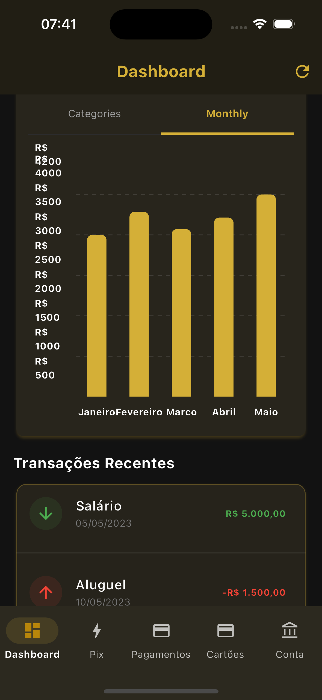
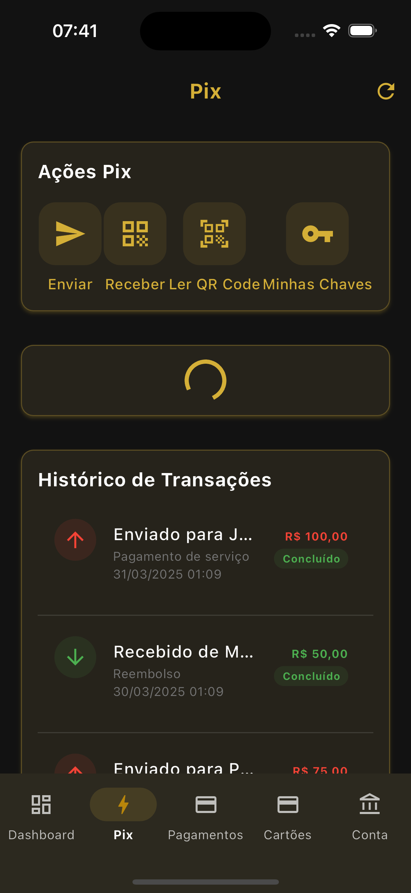
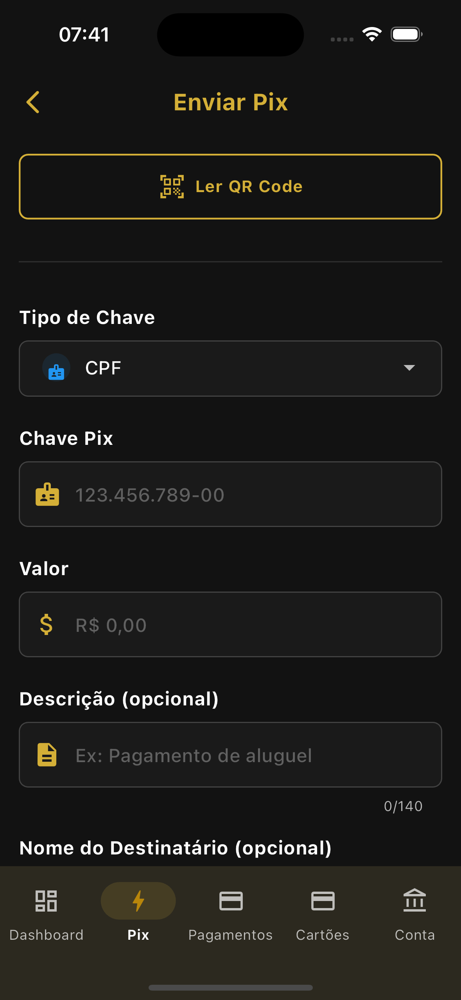
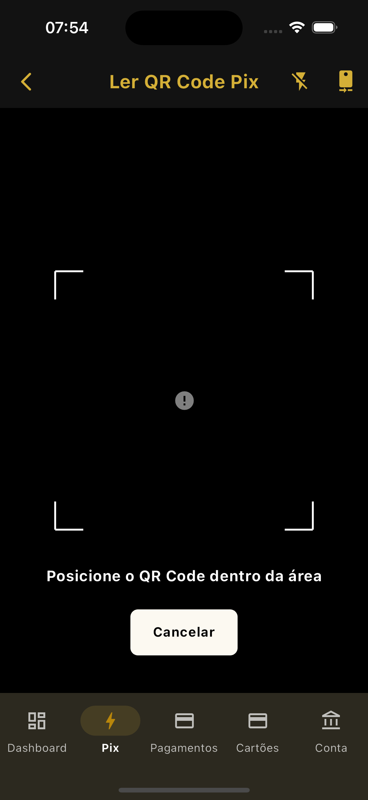
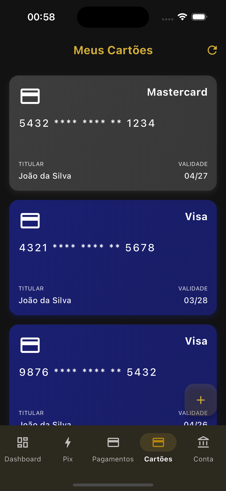
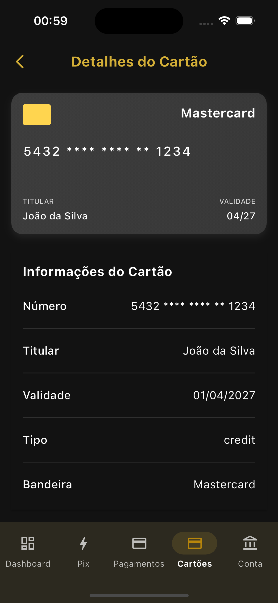

# Premium Bank - Flutter Super App (WIP)

<div align="center">

[](https://flutter.dev)
[](https://dart.dev)
[](https://github.com/cristianoaredes/super-app-flutter-sample)
[](https://bloclibrary.dev)
[](https://github.com/cristianoaredes/super-app-flutter-sample)
[](https://choosealicense.com/licenses/mit/)

English | [Português](README.md)

</div>

<p align="center">
  
</p>

> 🏦 A modular banking super app built with Flutter, implementing a scalable and modern architecture for financial applications.

## 🌟 Highlights

- 📱 Modern and intuitive interface
- 🔒 Security and privacy first
- 🚀 High performance and optimization
- ♿ Accessibility as a priority
- 🌐 Multi-language support (coming soon)

This project implements a modular architecture for Flutter using the micro apps concept, focusing on on-demand initialization, component lifecycle management, and communication between independent modules.

## Main Features

- **Modular Architecture**: Use of isolated and independent micro apps
- **On-Demand Initialization**: Loading modules only when needed
- **Robust State Management**: Safe implementation with BLoC/Cubit
- **Failure Recovery**: Automatic detection and recovery of invalid states
- **Smart Route Middleware**: Route management with automatic module initialization

## Main Technologies

- **Flutter**: 3.29.2
- **Dart**: 3.7.2
- **State Management**: bloc 8.1.6 with flutter_bloc and hydrated_bloc 9.1.5
- **Dependency Injection**: get_it 7.7.0
- **Navigation**: go_router 12.1.3
- **Generated Code**: freezed 2.5.8 and json_serializable 6.8.0
- **Storage**: shared_preferences 2.2.3 and path_provider 2.1.4
- **Network**: http 1.2.2 and dio 5.3.3

## Project Structure

The project is organized into three main layers:

1. **Super App**: Orchestrates micro apps and provides shared functionalities
2. **Micro Apps**: Implement specific functionalities independently
3. **Core Packages**: Provide shared functionalities between micro apps

```
flutter_arqt/
├── packages/
│   ├── core/                  # Core packages
│   │   ├── core_analytics/    # Analytics service
│   │   ├── core_interfaces/   # Shared interfaces
│   │   ├── core_network/      # Network service
│   │   ├── core_storage/      # Storage service
│   │   ├── core_logging/      # Logging service
│   │   ├── core_feature_flags/ # Feature flags
│   │   └── core_communication/ # Inter-micro app communication
│   │
│   └── micro_apps/            # Micro apps
│       ├── account/           # Account micro app
│       ├── auth/              # Authentication micro app
│       ├── cards/             # Cards micro app
│       ├── dashboard/         # Dashboard micro app
│       ├── payments/          # Payments micro app
│       ├── pix/               # Pix micro app
│       └── splash/            # Splash screen micro app
│
└── super_app/                 # Main application
    ├── lib/
    │   ├── core/              # Super app core implementations
    │   │   ├── di/            # Dependency injection
    │   │   ├── router/        # Route configuration
    │   │   ├── services/      # Shared services
    │   │   ├── theme/         # Theme configurations
    │   │   └── widgets/       # Shared widgets
    │   └── main.dart          # Entry point
    └── test/                  # Tests
```

## Implemented Features

- **Authentication**: Login with email/password and mocked credentials
- **Dashboard**: Display of account summary and transactions
- **Payments**: Payment management
- **Pix**: Pix transfers and key management
- **Cards**: Card management
- **Account**: Account details and statement

## Test Credentials

To test the application, you can use:

- **Email**: `user@example.com`
- **Password**: `password`

## Getting Started

### Prerequisites

- Flutter 3.29.2
- Dart 3.7.2
- Java 17+ (for Android)
- Xcode 14+ (for iOS)
- Android Studio 2023.1+ or VS Code with Flutter/Dart extensions

### Installation

1. Clone the repository:
   ```bash
   git clone https://github.com/cristianoaredes/super-app-flutter-sample.git
   cd super-app-flutter-sample
   ```

2. Install dependencies:
   ```bash
   flutter pub get
   cd super_app
   flutter pub get
   ```

3. Run the app:
   ```bash
   cd super_app
   flutter run
   ```

## Project Status (WIP)

This project is currently under active development (Work In Progress). We are continuously implementing new features and improvements.

## Recent Improvements

- **Updated to Flutter 3.29.2**: Updated the project to the latest stable Flutter version.
- **Dependencies Update**: Updated all dependencies to the latest compatible versions.
- **Java 17+ Compatibility**: Configured the project to be compatible with Java 17 and higher versions.
- **Fixed "Cannot emit new states after calling close" error**: Implemented a robust system to manage Bloc/Cubit lifecycle and prevent state emission after closure.
- **Automatic initialization middleware**: Created a route middleware that automatically initializes micro apps on demand.
- **Invalid state recovery**: Added mechanisms to detect and recover from invalid micro app states.
- **Renamed to Premium Bank**: Changed the app name to "Premium Bank" across all platforms.
- **Added permissions**: Added necessary permissions for camera, storage, location, and biometrics.

## Next Steps

- Add unit and widget tests
- Implement CI/CD with GitHub Actions
- Add biometric authentication
- Implement light/dark theme support
- Improve interface responsiveness
- Implement real API integration

## Screenshots

<table>
  <tr>
    <td align="center"><b>Login</b></td>
    <td align="center"><b>Dashboard</b></td>
    <td align="center"><b>Menu</b></td>
    <td align="center"><b>Cards List</b></td>
    <td align="center"><b>Card Details</b></td>
  </tr>
  <tr>
    <td></td>
    <td></td>
    <td></td>
    <td></td>
    <td></td>
  </tr>
  <tr>
    <td align="center"><b>Pix Area</b></td>
    <td align="center"><b>Pix Transfer</b></td>
    <td align="center"><b>Pix Keys</b></td>
    <td align="center"><b>Payments</b></td>
    <td align="center"><b>New Payment</b></td>
  </tr>
  <tr>
    <td></td>
    <td></td>
    <td></td>
    <td></td>
    <td></td>
  </tr>
</table>

## 🔍 Keywords
`flutter` `dart` `super-app` `fintech` `mobile-banking` `bloc-pattern` `clean-architecture` `modular-architecture` `dependency-injection` `micro-apps` `flutter-banking` `mobile-development` `flutter-example` `flutter-template` `banking-app` `flutter-architecture` `flutter-best-practices` `flutter-patterns` `flutter-clean-code` `flutter-modular`

## 📊 Project Metrics

[](https://github.com/cristianoaredes/super-app-flutter-sample/stargazers)
[](https://github.com/cristianoaredes/super-app-flutter-sample/network/members)
[](https://github.com/cristianoaredes/super-app-flutter-sample/issues)

## 🤝 Maintainers

<table>
  <tr>
    <td align="center">
      <a href="https://github.com/cristianoaredes">
        <br>
        <sub>
          <b>Cristiano Aredes</b>
        </sub>
      </a>
    </td>
  </tr>
</table>

## 📫 Contact

For suggestions, questions, or contributions:

- 📧 Email: cristiano@aredes.me
- 💼 LinkedIn: [Cristiano Aredes](https://www.linkedin.com/in/cristianoaredes/)

## ⭐ Show your support

If this project helped you in any way, consider:

- ⭐ Giving a star on GitHub
- 🐛 Reporting bugs or suggesting improvements in [Issues](https://github.com/cristianoaredes/super-app-flutter-sample/issues)
- 🔀 Making a fork and contributing to the project
- 📢 Sharing with other developers

## 📝 Citation

If you use this project as a reference in articles or studies, please cite:

```bibtex
@software{premium_bank_flutter,
  author = {Cristiano Aredes},
  title = {Premium Bank - Flutter Super App},
  year = {2024},
  publisher = {GitHub},
  url = {https://github.com/cristianoaredes/super-app-flutter-sample}
}
```

---
<div align="center">
  Made with ❤️ by <a href="https://github.com/cristianoaredes">Cristiano Aredes</a>
</div> 